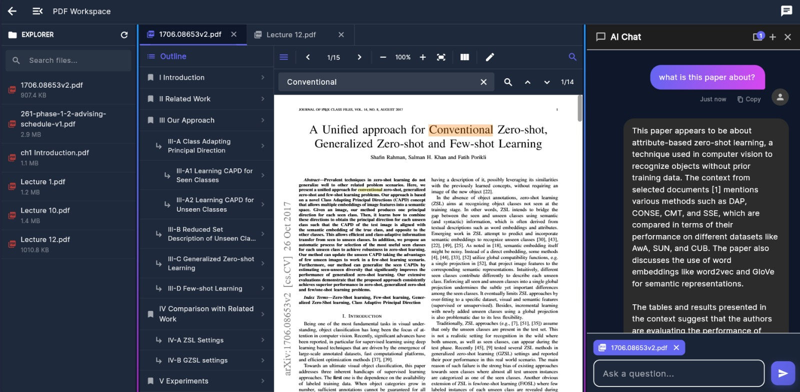
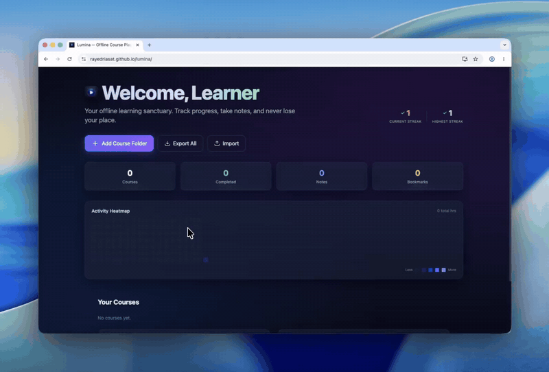
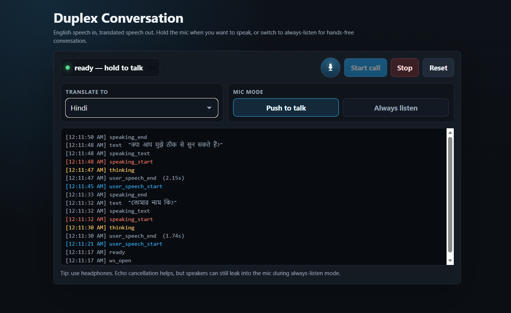
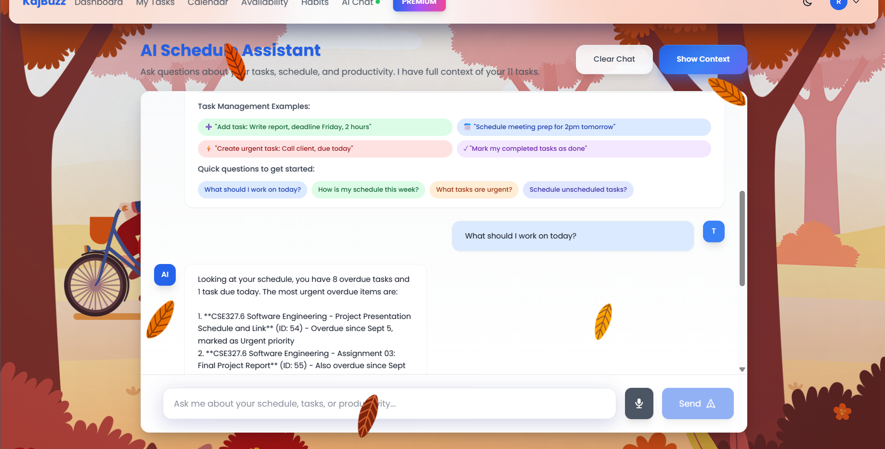

<picture>
  <source media="(prefers-color-scheme: dark)" srcset="assets/banner-dark.svg">
  <source media="(prefers-color-scheme: light)" srcset="assets/banner-light.svg">
  
</picture>

<picture>
  <source media="(prefers-color-scheme: dark)" srcset="https://readme-typing-svg.demolab.com?font=JetBrains+Mono&weight=600&size=18&duration=2800&pause=800&color=34D399&center=true&vCenter=true&width=820&height=40&lines=%24+build+rag_systems+--offline-first;%24+compress+ml_models+--deployable;%24+ship+full_stack_products+--real-users;%24+automate+workflows+--save-hours">
  <source media="(prefers-color-scheme: light)" srcset="https://readme-typing-svg.demolab.com?font=JetBrains+Mono&weight=600&size=18&duration=2800&pause=800&color=047857&center=true&vCenter=true&width=820&height=40&lines=%24+build+rag_systems+--offline-first;%24+compress+ml_models+--deployable;%24+ship+full_stack_products+--real-users;%24+automate+workflows+--save-hours">
  
</picture>

## ./whoami

<table>
  <tr>
    <td width="140"><b>Identity</b></td>
    <td>CSE undergraduate at North South University, Dhaka</td>
  </tr>
  <tr>
    <td><b>Builds</b></td>
    <td>RAG systems, AI agents, ML compression research, offline-first apps, workflow automation</td>
  </tr>
  <tr>
    <td><b>Recognition</b></td>
    <td>ICPC Asia Dhaka Regionalist &middot; 100% merit scholarship &middot; APMEE 2025 Best Session Performer</td>
  </tr>
  <tr>
    <td><b>Current mode</b></td>
    <td>Turning research ideas into polished software that real users can touch</td>
  </tr>
  <tr>
    <td><b>Open to</b></td>
    <td>AI research collaborations, full-stack engineering roles, internships</td>
  </tr>
</table>

I work at the intersection of research, product thinking, and engineering: semantic document search,
structured model compression, schedule optimisation, speech translation systems, academic productivity
tools, and automation that gives people their hours back.

## ./github-pulse

<picture>
  <source media="(prefers-color-scheme: dark)" srcset="assets/stats-dark.svg">
  <source media="(prefers-color-scheme: light)" srcset="assets/stats-light.svg">
  
</picture>

<picture>
  <source media="(prefers-color-scheme: dark)" srcset="https://streak-stats.demolab.com?user=rayedriasat&hide_border=true&background=00000000&ring=34D399&fire=22D3EE&currStreakLabel=34D399&currStreakNum=E6EDF3&sideLabels=A8BACD&sideNums=A8BACD&dates=6B8299&stroke=1E3A4A">
  <source media="(prefers-color-scheme: light)" srcset="https://streak-stats.demolab.com?user=rayedriasat&hide_border=true&background=00000000&ring=047857&fire=0369A1&currStreakLabel=047857&currStreakNum=0B1B2B&sideLabels=41566B&sideNums=41566B&dates=64798F&stroke=D5DEE6">
  
</picture>

The card above is generated from the GitHub API by
<a href="scripts/generate_profile_stats.py"><code>scripts/generate_profile_stats.py</code></a> and committed to this repo,
so it never depends on a third-party widget staying online.

<table>
  <tr>
    <td align="center" width="25%"><b>AI Systems</b> RAG, agents, semantic search</td>
    <td align="center" width="25%"><b>ML Research</b> structured pruning, speech translation</td>
    <td align="center" width="25%"><b>Products</b> web, mobile, offline-first, PWA</td>
    <td align="center" width="25%"><b>Automation</b> scraping, bots, workflow tooling</td>
  </tr>
</table>

## ./selected-work

<table>
  <tr>
    <td width="50%" valign="top">
      
      <h3>ScholarMate</h3>
      
<b>Offline-first AI research workspace</b>

      
RAG-powered workspace for semantic document search, PDF annotation, OCR and scanning,
      read-aloud, realtime collaboration, and Google&nbsp;Drive-backed sync where the user keeps ownership of their files.

      

        
        
        
        
      

      
<b>Impact:</b> faculty-trusted team lead; APMEE 2025 Best Session Performer.

      <!-- Live deployment https://scholarmate.northsouth.app/ was returning 502 when this README was built.
           To restore, put back: <a href="https://scholarmate.northsouth.app/"><b>Live demo</b></a> &nbsp;·&nbsp; -->
      
<a href="https://github.com/rayedriasat/ScholarMate"><b>Repository</b></a>

    </td>
    <td width="50%" valign="top">
      
      <h3>Lumina </h3>
      
<b>Offline course player &mdash; PWA + desktop</b>

      
Zero-backend glassmorphism PWA that turns a local course folder into a sequential learning
      experience: gamification, subtitle search, markdown notes, bookmarks, activity heatmap, and a built-in PDF/HTML viewer.

      

        
        
        
        
      

      
<b>Impact:</b> fully offline via the File System Access API; Netflix-style auto-proceed, speeds to 3.5x.

      
<a href="https://rayedriasat.github.io/lumina/"><b>Live app</b></a> &nbsp;·&nbsp; <a href="https://github.com/rayedriasat/lumina">Repository</a>

    </td>
  </tr>
  <tr>
    <td width="50%" valign="top">
      
      <h3>Pruning-SeamlessM4T</h3>
      
<b>ML compression for multilingual speech translation</b>

      
Structured pruning, recovery fine-tuning, and deployment pipeline for Meta SeamlessM4T&nbsp;v2,
      ending in a duplex real-time translation web app.

      

        
        
        
      

      
<b>Impact:</b> 39.7% fewer parameters, 1.84x speedup, runs in 4&nbsp;GB VRAM.

      
<a href="https://github.com/rayedriasat/Pruning-SeamlessM4T"><b>Repository</b></a>

    </td>
    <td width="50%" valign="top">
      
      <h3>KajBuzz</h3>
      
<b>Intelligent academic task planner</b>

      
AI-assisted scheduler that plans student work from deadlines, priorities, and real availability,
      syncing both ways with Google Calendar and Canvas LMS.

      

        
        
        
        
      

      
<b>Impact:</b> smart scheduling, overload detection, Pomodoro, analytics, LMS sync.

      <!-- The PythonAnywhere deployment https://rayed.pythonanywhere.com/ was returning 404 when this README was built.
           To restore, put back: <a href="https://rayed.pythonanywhere.com/"><b>Live demo</b></a> &nbsp;·&nbsp; -->
      
<a href="https://github.com/rayedriasat/intelligent_task_planner"><b>Repository</b></a>

    </td>
  </tr>
</table>

## ./more-builds

<table>
  <tr>
    <th align="left" width="24%">Project</th>
    <th align="left" width="46%">What it does</th>
    <th align="left" width="30%">Stack</th>
  </tr>
  <tr>
    <td><a href="https://github.com/rayedriasat/rds2simulator">RDS2 Simulator</a> <a href="https://rayedriasat.github.io/rds2simulator/">live</a></td>
    <td>Fast course search and filtering over RDS2 data, built as a zero-dependency static app.</td>
    <td>JavaScript &middot; Bootstrap &middot; GitHub Pages</td>
  </tr>
  <tr>
    <td><a href="https://github.com/rayedriasat/pytorch-zerotomastery">PyTorch ZTM &mdash; Immersive Edition</a></td>
    <td>Fork of Daniel Bourke's PyTorch course docs with progress tracking, gamified completion, highlight/bookmark, freehand annotation, and better math rendering.</td>
    <td>Jupyter &middot; JavaScript &middot; MkDocs</td>
  </tr>
  <tr>
    <td><a href="https://github.com/rayedriasat/bconnect">BloodConnect</a></td>
    <td>Role-based blood donation platform: proximity matching, messaging, appointment and admin workflows.</td>
    <td>PHP &middot; MySQL &middot; OpenStreetMap</td>
  </tr>
  <tr>
    <td><a href="https://github.com/rayedriasat/StudyManager">StudyManager</a></td>
    <td>React Native study companion with Supabase auth/storage and two-way Google Calendar sync.</td>
    <td>React Native &middot; TypeScript &middot; Supabase</td>
  </tr>
  <tr>
    <td><a href="https://github.com/rayedriasat/Rays_mpv_conf">Rays_mpv_conf</a></td>
    <td>Opinionated MPV setup: one-keypress subtitle search with exact release matching, persistent cross-reboot history UI, folder and playlist position memory.</td>
    <td>Lua &middot; PowerShell &middot; MPV</td>
  </tr>
  <tr>
    <td><a href="https://github.com/rayedriasat/cse465-voice-project">CSE465 Voice Project</a></td>
    <td>Speech/voice modelling coursework and experiments in notebook form.</td>
    <td>Jupyter &middot; PyTorch</td>
  </tr>
  <tr>
    <td><a href="https://github.com/rayedriasat/rds2tg">rds2tg</a> &middot; <a href="https://github.com/rayedriasat/vjudge-transfer">vjudge-transfer</a></td>
    <td>Automation toolkit: a Telegram bot around RDS2, and a Selenium script that archives a VJudge user's accepted solutions locally.</td>
    <td>Python &middot; Selenium &middot; Telegram Bot API</td>
  </tr>
</table>

Also in the archive: <a href="https://github.com/rayedriasat/clothStore-Manager">clothStore-Manager</a> (Java),
<a href="https://github.com/rayedriasat/taskflow_project">taskflow_project</a>,
<a href="https://github.com/rayedriasat/PyModoro">PyModoro</a>,
<a href="https://github.com/rayedriasat/TurtleRoadCrossGame">TurtleRoadCrossGame</a>,
<a href="https://github.com/rayedriasat/cse115project">cse115project</a> (bank management in C).

## ./research

<table>
  <tr>
    <td width="30%"><b>Model compression</b></td>
    <td>Structured pruning and recovery for large multilingual speech models, taken all the way to a deployable duplex app (<a href="https://github.com/rayedriasat/Pruning-SeamlessM4T">public</a>)</td>
  </tr>
  <tr>
    <td><b>Retrieval systems</b></td>
    <td>Offline-first RAG over personal document collections &mdash; chunking, embedding, and sync strategies that survive going offline</td>
  </tr>
  <tr>
    <td><b>Vision-language reliability</b></td>
    <td>Diagnostics for hallucination in large vision-language models &mdash; manuscript in preparation (private repository)</td>
  </tr>
</table>

## ./stack

**Languages**

**AI / ML**

**Frameworks & Platforms**

**Data & Infra**

## ./certificates

<table>
  <tr>
    <td width="50%" valign="top">
      <h3>CS50x</h3>
      
<b>Harvard University</b>

      
Foundational computer science: C, Python, algorithms and data structures, web, SQL, and systems thinking.

      
      
<a href="https://cs50.harvard.edu/certificates/e34a2ad2-10c6-4dba-b480-3309c36df920">Verify certificate</a>

    </td>
    <td width="50%" valign="top">
      <h3>Supervised Machine Learning</h3>
      
<b>DeepLearning.AI &middot; Stanford Online</b>

      
Regression, classification, model evaluation, and the supervised learning foundations behind the rest of the stack.

      
      
<a href="https://www.coursera.org/account/accomplishments/records/CABAIJ27871G">Verify certificate</a>

    </td>
  </tr>
</table>

<!-- ./contribution-snake ---------------------------------------------------

The "Refresh profile" workflow publishes a snake animation of this
contribution graph to the `output` branch. That branch does not exist until
the workflow has run once, so this block stays commented out to avoid a
broken image.

To turn it on: merge to `main`, open Actions -> "Refresh profile" -> Run
workflow, then delete the two comment markers around the block below.

<picture>
  <source media="(prefers-color-scheme: dark)" srcset="https://raw.githubusercontent.com/rayedriasat/rayedriasat/output/snake-dark.svg">
  <source media="(prefers-color-scheme: light)" srcset="https://raw.githubusercontent.com/rayedriasat/rayedriasat/output/snake-light.svg">
  
</picture>

-------------------------------------------------------------------------- -->

<b>Open to AI research, full-stack engineering, internships, and ambitious student-built products.</b>

  

  

<picture>
  <source media="(prefers-color-scheme: dark)" srcset="https://komarev.com/ghpvc/?username=rayedriasat&style=flat-square&color=34D399&label=Profile+views">
  <source media="(prefers-color-scheme: light)" srcset="https://komarev.com/ghpvc/?username=rayedriasat&style=flat-square&color=047857&label=Profile+views">
  
</picture>

